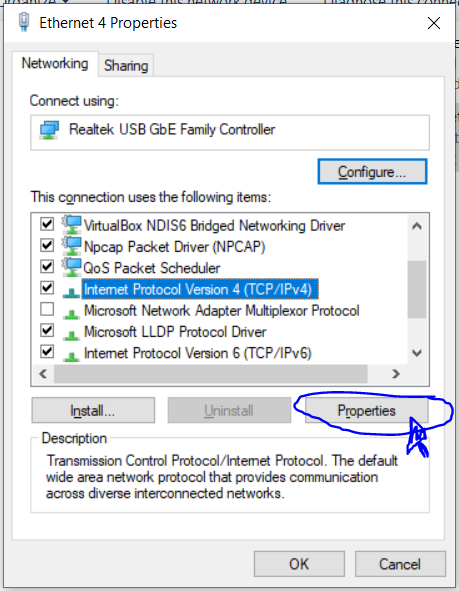

# Ubiquiti Bullet and Powerbeam M2

**INITIAL SETUP**

First, power the M2 and Dish \(Powerbeam\) using PoE injectors. Generally, you want to use a battery-powered injector for the M2 and an AC powered injector for the Dish. The leftmost LED should be green. Wait for 30 seconds to see if the rest of the M2 & Dish LEDs light up. If they do, skip to the next section.

If nothing happens, it means M2 hasn’t connected to the Dish’s Access Point yet. First, you should check all available Wi-Fi connections. If something like TJ-AP or TJ-GS shows up, the Dish is doing its job. Otherwise, you want to access the Dish’s configuration page by typing 192.168.1.20 in a browser. If this does not work, you must set a static IP for the Dish. On a linux computer, use the following command:

`sudo ifconfig eth0 192.168.1.7 netmask 255.255.255.0`

On a windows computer, go to _Start Menu &gt; Control Panel &gt; Network and Sharing Center or Network and Internet &gt; Network and Sharing Center_. Click on _Change Adapter Settings_ in the left panel. A list of connections will be displayed. Right click on the Ethernet connection with the description “Unidentified Network”. Click on Properties, then find _Internet Protocol Version 4 \(TCP/IPv4\)_ in the scrolling menu. Should look like this:

Click on Properties, then click _Use the following IP Address._

Set the IP address to 192.168.1.7 or 192.168.1.x where x is any number except for 20.

You should now be able to access 192.168.1.20 in a browser. If you don’t know the login, ask around. If absolutely no one in the club knows the login, you must factory reset the Bullet and repeat above steps. The default login is **ubnt** for both user and password. Click on the Systems tab and in the bottom right, click on “Upload Configuration”. Upload the Dish configuration file from our GCS repo.

Now access the Bullet M2’s configuration in a browser. Upload the M2 configuration file from our GCS repo.

**ONCE ALL LEDS ARE LIT**

You can now attempt python socket connections. Find the IP address you statically assigned to the Dish \(most likely 192.168.1.7\). On your Ground Station computer, you must bind to yourself and wait for connections:

`s=socket.socket(socket.AF_INET,socket.SOCK_STREAM)`

`s.bind((DISH_IP,PORT))`

`conn,addr=s.accept()`

On the flight companion computer, connect to the GS’s open socket:

`client_socket = socket.socket(socket.AF_INET, socket.SOCK_STREAM)`

`client_socket.connect((DISH_IP, PORT))`

You can now transmit & receive data over the Ubiquiti devices.

Not working?

* Try pinging the Dish’s IP from both computers
* Make sure you are connecting over the same port
* Don’t attempt multiple connections over the same socket; kill both scripts and try again.

