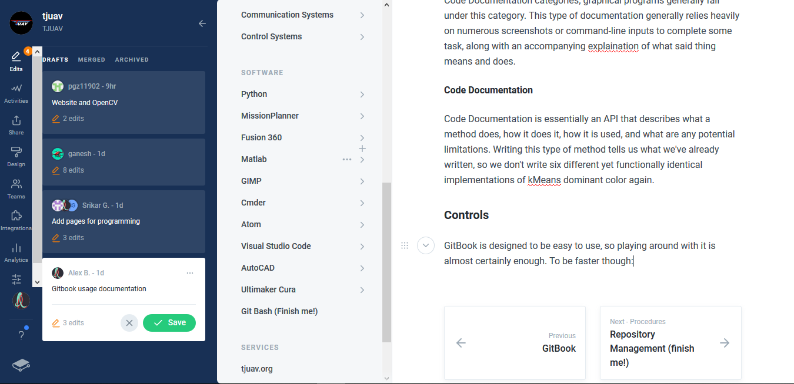

# Basic Usage \(finish me!\)

The entire idea of GitBook is to not forget anything, and to provide as a reference to further the understanding of parts for all members of TJUAV.

### Types of Documentation

#### Setup Documentation

Setup Documentation should be a step-by-step guide on how to complete a task for various operating systems commonly used through TJUAV. This type of documentation will generally consist of links to relevant sites for quick access or further reading, screenshots to showcase some aspect of the process that may be not obvious, or command-line 

#### Procedural Documentation

Sometimes we have a clear procedure on how to do some task for the sake of order or consistency among various members, or just the steps for completing some task that doesn't quite fall under the Setup or Code Documentation categories; graphical programs generally fall under this category. This type of documentation generally relies heavily on numerous screenshots or command-line inputs to complete some task, along with an accompanying explaination of what said thing means and does.

#### Code Documentation

Code Documentation is essentially an API that describes what a method does, how it does it, how it is used, and what are any potential limitations. Writing this type of method tells us what we've already written, so we don't write six different yet functionally identical implementations of kMeans dominant color again.

### Controls


Make sure you never put confidential information on GitBook. Once it's here it's never going away.



Make sure you save often, because if someone else accidentally merges your branch while you're editing, it'll delete everything you have. Discovered while writing this page.


GitBook is designed to be easy to use, so playing around with it is almost certainly enough. To be faster though:

The above screenshot shows the administrative level interface, the writers interface is much the same minus a few buttons here and there.

#### Left Panel

The most important part of this entire interface is the Edits button at the top. Additional settings can be found below, but they contain very few options that take only a minute to understand at most, stuff like customization and whatnot.

#### Left Extended Panel

This is that menu that you see for your selection on the left panel. You can see all drafts there, and you can select one to view what's contained in the draft. To make a new draft, all you need to do is start typing somewhere - it's that easy. When you're working on a draft you have the options to save or delete all changes, the white box shows this page in progress. Once you save, you also have the option to Merge, signified by the Purple button. This refers to GitBook's underlaying use of git; this would signify merging the branch with your edits into the master documentation branch.


Because GitBook manages the master branch located in the tj-uav documentation repository, strict controls are not placed unlike other tj-uav repositories.


#### Navigation Panel

The Navigation Panel is the 

