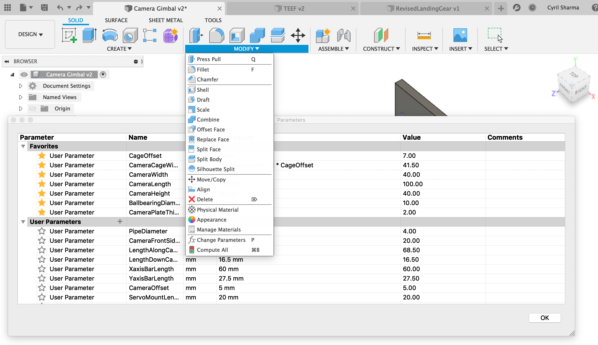

# CAD Guide

## Sketches

Sketches are used to model in Fusion 360.  A sketch is a 2d plane you define where you define 2d shapes to be modified in 3d.  By using the project command, sketches can include geometry from outside the plane or the intersections of the plane and 3d geometry.

## Parameterization

CAD designs change frequently. That's why it's necessary to program variables in your CAD, called parameters, in case any of your dimensions change. To access it, just click on modify, and then change parameters. 

Parameters must match the dimensions of what they describe. Angular measurement must be made in degrees or radians, lengths in some form of meters, etc.  Another important thing to note is that you shouldn't have to use a calculator to calculate any dimensions. This is because computations can be put directly in your definitions of parameters: addition, subtraction, multiplication, etc.

## Timeline

Another basic concept in Fusion is a series of events. Many different operations may need to be performed to create complex shapes, and Fusion keeps track of this in the Timeline. Different icons represent different operations, like New Sketch, Extrude, and Revolve. 

