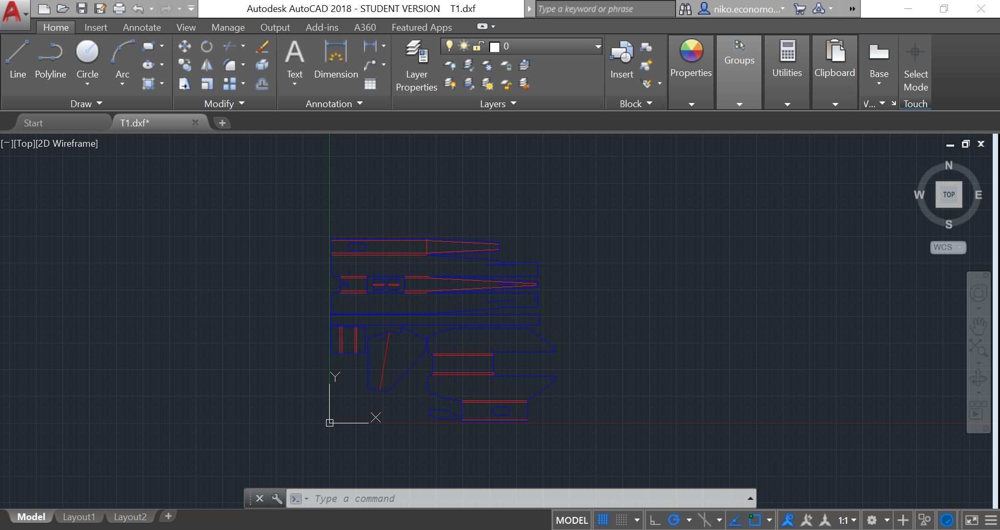
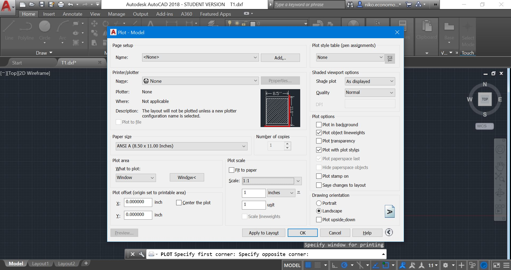

# Laser Cutting

Laser cutting makes use of AutoCAD, an Autodesk software used to format 2D CAD.



1. Import your file into AutoCAD \(DXF or DWG\)
   * If your file is a pdf \(as seen in Flite Test's plans like the [Tiny Trainer](https://s3.amazonaws.com/plans.flitetest.com/stonekap/FT-Mini%20TinyTrainer-plans.pdf)\) you can use [this website](https://www.zamzar.com/convert/pdf-to-dxf/) to convert it to dxf.
   * If you first cadded the file in Fusion 360, you can export faces as dxf, as seen in [this tutorial](https://knowledge.autodesk.com/support/fusion-360/learn-explore/caas/sfdcarticles/sfdcarticles/Converting-Fusion-360-to-DWG-or-DXF.html).
2. In properties, ensure that all throughcut lines are one color and all score lines are another color.
3. In properties, ensure all lines are 0.00 mm thick.
4. Type OVERKILL into the command line and press enter
   * This removes any overlapping lines
5. Press Ctrl+P
   1. Change what to plot to Window and select your window \(it should be just the size of the CAD and no larger than the size of your laser cutter
   2. Uncheck fit to paper in plot scale and change the scale to 1:1
   3. Change plot style table to laser.ctb
   4. Change the printer/plotter to the laser cutter you are using \(e.g. Epilogue\)
   5. Click properties in printer/plotter and then custom properties
   6. Ensure that the colors you chose to be throughcut and score have the proper speed and power settings for the material you are using
   7. Press apply changes
   8. Press apply to layout
6. The settings should be sent to the printer
7. Go to the epilogue plotter - your design should be visible
8. Send the design to the laser cutter and insert your wood, foam, or other material into the laser cutter
9. Press the green button on the printer to start printing - note that the air and fan should be on


Collect your finished parts when it's finished


