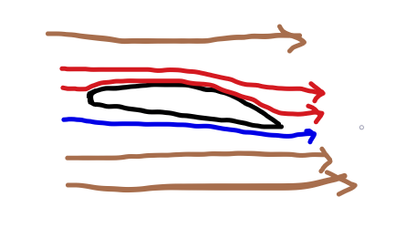

# Aerodynamics

Aerodynamics is the study of how air interacts with solid objects \(such as an RC airplane\) moving through it. 

It's important to know basic aerodynamics because planes utilize the air around them to generate lift and maneuver using control surfaces. 

**How lift is generated by the wings:**

Most RC planes have airfoils that have curvature on top and a flat bottom surface. As the wing moves through the air, it leaves gaps \(or low pressure zones\) in the air behind. Imagine pushing an oar through water, as you try to move the oar, it leaves gaps where it just was which the water then rushes in to fill. The curvature of the top of the airfoil means that the area behind it isn't exposed to oncoming airflow. This means that a gap \(or low pressure zone\) forms on the rear of the top of the airfoil. 

As you can see, the are behind the wing is not exposed to oncoming airflow. To compensate for this pressure difference, the air flowing above the wing will rush downwards to fill this gap, this speeds up the air and therefore, decreases it's pressure. \(Since faster moving particles are heated up and take up more space\). In fact, the air above the wing flows much faster than the air beneath even after it leaves the airfoil.

The air flowing above the wing is less dense and has lower pressure. The air flowing below the wing will be slowed down by the bottom face of the airfoil and, therefore, compressed, creating a dense, high pressure zone. The higher pressure below the wing, pushes on the wing from beneath while the low pressure above the wing pulls on it from above. This helps generate lift. 

Another important part of lift is that air beneath the wing is deflected downward by the bottom face of the wing and the air above the wing is being pulled downward by the low pressure generated by the wing, both of these actions push the wing up due to the fact that every action has an equal and opposite reaction.

**Angle of attack:** Increasing the angle of attack of a wing will cause it to deflect more air and create a larger pressure gradient between the top and bottom of the wing leading to more lift. However, once the angle of attack and pressure gradient

