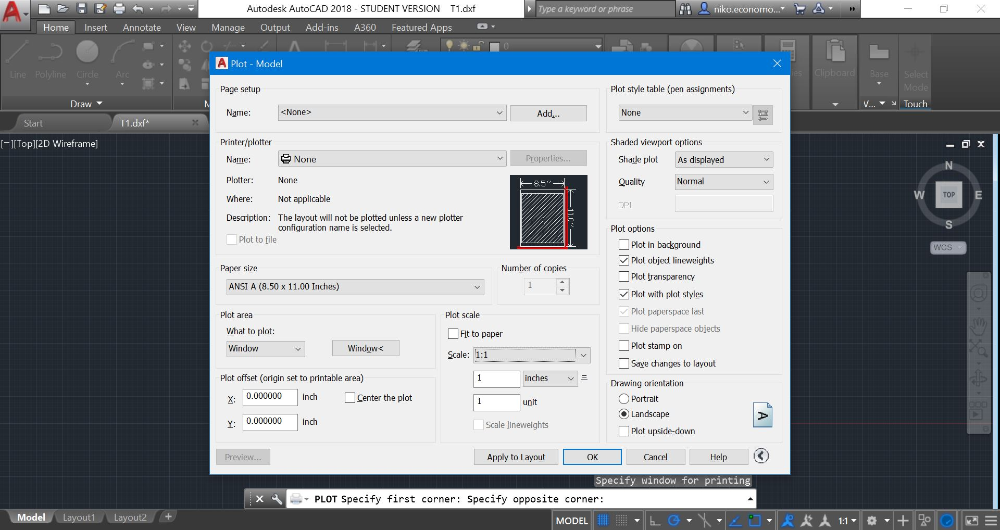

# Laser Cutter

**Formatting**  
Import your file into AutoCAD. Find the page for your plane, click Resources, then download the Full Plans. In a new file in AutoCAD, import the plans as a PDF.

Foam board is like a sandwich. The bread is paper, and the inside is the foam. A full cut cuts through all three layers, score cut is one paper layer and the foam, leaving one layer of paper left, and a crease cut cuts through only one layer of paper, but no foam.

Disclaimer: in the image above, the regular cuts were set to red, but that is incorrect. Set them to Blue. Throughout this tutorial, score cuts were mistakenly set to blue, and full cuts were mistakenly set to red. It should be the other way around.

Your goal will be to fit all the parts within 18x24 inch rectangles, and as least rectangles as possible. This is because TJ's largest laser cutters can cut 18x24 inches maximum. Your final result should be multiple dxf files that are numbered, each with only one 18x24 rectangle containing parts. Try not to have any parts sit on the edge of the rectangle, as the laser cutter's range is actually slightly less than 18x24.  
  
**Cutting**

1. Press Ctrl+P
   1. Change the Printer/plotter name to the laser cutter you are using
   2. Click Properties..., Advanced Settings, and adjust the color settings appropriate to your color scheme \(Red: cut, Blue: score, Green/Cyan: reference\) \*
   3. Change What to plot to Window, then click on two corners of the 18x24 rectangle that are not adjacent
   4. Uncheck Fit to paper
   5. Change Scale to 1:1
   6. Change Plot style table to laser.ctb
   7. Click Apply to Layout
   8. Click Preview... to make sure your lines show up and the plot matches your format
   9. Click OK
2. Put a sheet of 18x24 inch foam board into the laser cutter
3. Click focus and adjust the laser cutter to the correct height
4. Turn on the ventilation and open the air valve
5. Press the green button on the printer to start printing

