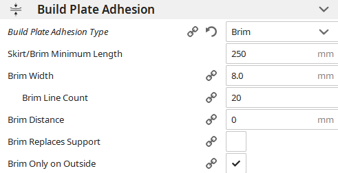

# Adhesion

Here, only the type really matters.

**Skirt:** A distance away from your print it makes a ring a few lines thick to purge old filament to prime the extruder. HIGHLY RECOMMENDED TO USE INSTEAD OF "NONE"

**Brim:** Exactly like Skirt but this TOUCHES your prints so that they don't separate from the bed as often. ALSO PRETTY RECOMMENDED

**Raft:** Makes a thick, slow, wasteful, costly, stupid platform under your whole print. DO NOT USE

