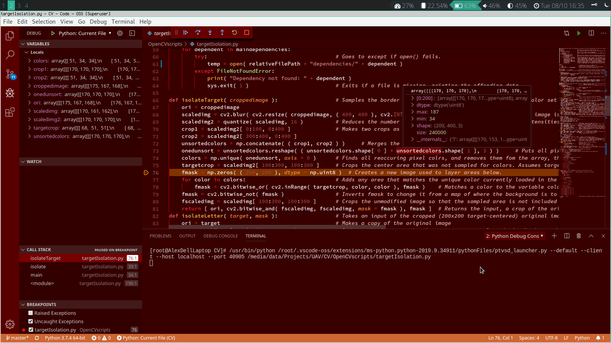

# Debugging


If you have not set up language support for the language you wish to program in, take a look at this page's subpages.


Debugging \(accessible by clicking on the bug icon\) is your best friend. Use it, and it help you out immensely. 

## Debug sections

### Variables

When you hit a breakpoint, the program will pause giving you read & write access to your variables. 

### Watch

This section logs the value of an expression. Simply highlight the area and click, then it will allow you. In practice this is often not super useful, but it has its cases.

### Call stack

This shows you all of the calls. In practice this is really only useful for recursion, but it can help you track what calls what for complex functions.

### Breakpoints

As you would do in jGrasp, click left of a line to set a breakpoint. In addition, you can allow the program to stop at a caught and uncaught exception by selecting those checkboxes. When stopped, the debugger will allow you to view the value of all variables.

### Problems Tab

If VSCode spots any issues with your code, it'll notify you here. There are two types of issues: warnings and errors. Although not recommended, it is often possible to ignore warnings. Errors, however, will stop the program from running.

### Outputs Tab

Often doesn't do much, as debugging instead prints to the terminal tab.

### Debug Console

When your program is at a breakpoint, you can use this to interact with your program by typing valid code. Similar to jGrasp interactions, but designed to interact with the active code.

### Terminal Tab

Any program outputs will be printed here. This is essentially your default command line as you would find in jGrasp when running a program. When debug is inactive this will be treated as a normal terminal line \(Powershell on Windows, whatever you use anywhere else\).

